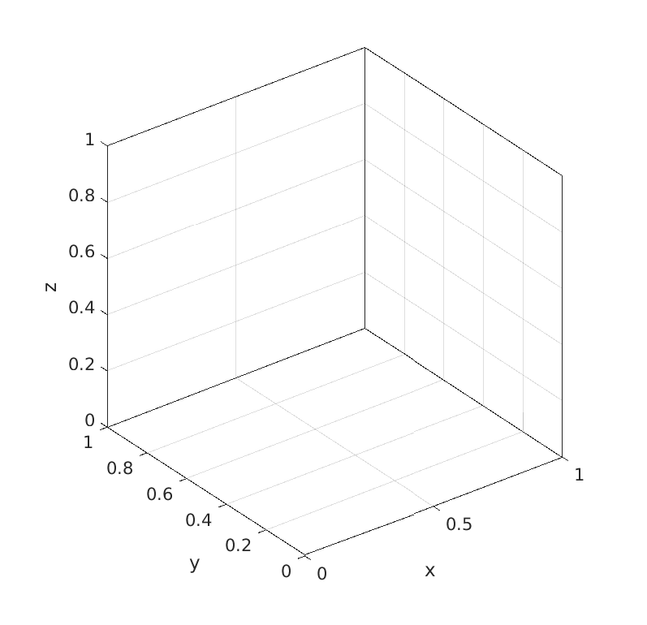

# PLOTLAB
Plotting spacecraft trajectories

`PLOTLAB` provides quick recipies for plotting trajectories using the MATLAB engine.
`PLOTLAB.jl` is a Julia wrapper to these MATLAB routines for generating plots directly from Julia, based on [`MATLAB.jl`](https://github.com/JuliaInterop/MATLAB.jl). 


## MATLAB requirements

- MATLAB license
- MATLAB version: developped on 2020a
- Toolboxes: 
	- Mapping Toolbox (for `plot_earth_geoid()` function)


## Usage via Julia

1. Make sure `MATLAB.jl` works on local Julia environment (install MATLAB, install `csh`)
2. `git clone` this repository & `cd` into `PLOTLAB`, then on Julia REPL `]dev .`
3. `using PLOTLAB` or `import PLOTLAB`

#### Julia Depenencies
- `MATLAB.jl`, `DocStringExtensions`


## Usage via MATLAB

1. `git clone` this repository
2. `addpath` to the `src/matlab` directory in MATLAB, i.e.

```matlab
addpath('/path/to/PLOTLAB/src/matlab')
```


## Main functions

#### Plotting spheres: 

- Obtain coordinates of 3D ellipsoid as wireframe: `celestial_body()`
- Plot Earth with coast lines: `plot_earth_geoid()`


## Gallery

<p align="center">
    
</p>
