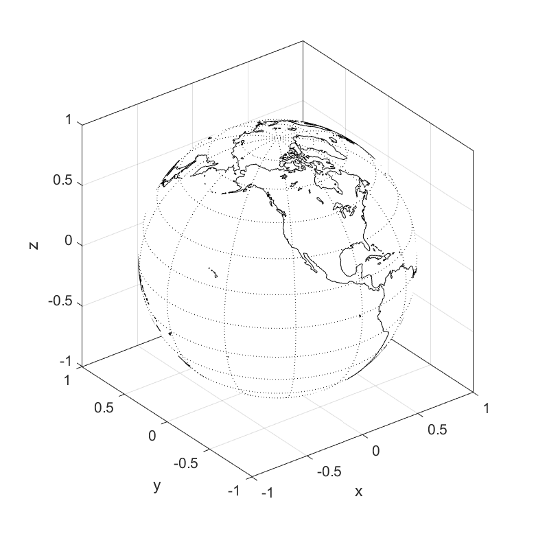

# PLOTLAB - making beautiful trajectory (+other) plots on Julia using the MATLAB engine

[Documentation](https://yuricst.github.io/PLOTLAB/) (For full version, run `make.jl` in `docs`.

Note: to view full API information, build documentation by running `julia docs/make.jl`


`PLOTLAB` provides quick recipes for plotting trajectories using the MATLAB engine.
`PLOTLAB.jl` is a Julia wrapper to these MATLAB routines for generating plots directly from Julia, based on [`MATLAB.jl`](https://github.com/JuliaInterop/MATLAB.jl).


## MATLAB requirements

- MATLAB license
- MATLAB version: developed on 2020a
- Toolboxes: Mapping Toolbox (for `plot_earth_geoid()` function)

## Usage via Julia

1. Make sure `MATLAB.jl` works on local Julia environment (install MATLAB, install `csh`)
2. `git clone` this repository & `cd` into `PLOTLAB`, then on Julia REPL `]dev .`
3. `using PLOTLAB` or `import PLOTLAB`

#### Julia Depenencies
- `MATLAB.jl`, `DocStringExtensions`


## Features (for plotting from Julia)

### Creating a figure

Creating a new MATLAB figure is as easy as

```julia
PLOTLAB.figure()
```

The `PLOTLAB.figure()` accepts optional parameters of the figure; here are some useful ones:

- `view::Int`: 2 for 2D, 3 for 3D view plot
- `axis_equal::Bool`: whether to set equal axes
- `xlabel::String`, `ylabel::String`, `zlabel::String`: names of axes
- `xlim::Vector{Real}`, `ylim::Vector{Real}`, `zlim::Vector{Real}`: limits on axes


### Choosing colors

So many options for defining colors of your plots!

```julia
color_list = cgrad(:hawaii)   # define a color palette alla moda di julia's plots

PLOTLAB.plot3(traj1[1,:], traj1[2,:], traj1[3,:], lw=1.5, color="blue")           # MATLAB color names
PLOTLAB.plot3(traj2[1,:], traj2[2,:], traj2[3,:], lw=1.5, color=:gold)            # Julia color symbol
PLOTLAB.plot3(traj3[1,:], traj3[2,:], traj3[3,:], lw=1.5, color=[1.0, 0.0, 0.0])  # vector [r,g,b]
PLOTLAB.plot3(traj4[1,:], traj4[2,:], traj4[3,:], lw=1.5, color=color_list[1])    # color object
```


#### Examples

```julia
import PLOTLAB

PLOTLAB.close_all()     # close all figure
fig = PLOTLAB.figure(
	3,
	size=[200,200,500,500],
	box=true
)                       # create new figure

# plot Earth
ticks = [-1.5, -1.0, -0.5, 0, 0.5, 1.0, 1.5]
PLOTLAB.plot_earth_geoid(1.0, ticks)

# save
PLOTLAB.saveas(fig, "example_geoid.png")
```

- See `./examples` for more

## Usage via MATLAB

The MATLAB routines can of course be used directly by adding path.

1. `git clone` this repository
2. `addpath` to the `src/matlab` directory in MATLAB, i.e.

```matlab
addpath('/path/to/PLOTLAB/src/matlab')
```


## Main functions

#### Plotting spheres:

- Plot Earth with coast lines: `plot_earth_geoid()`


## Gallery

- Geoid plot

<p align="center">
    
</p>


- Moon plot

<p align="center">
    
</p>

- 3D quiver

<p align="center">
    
</p>

- Tweaking colors

<p align="center">
    
</p>
